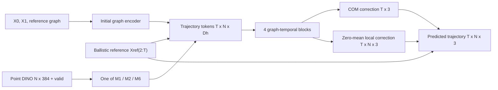

# V4.1 Architecture Design and Experiment Memo

Status: design for review; no implementation or production training is
authorized by this memo.

Date: 2026-07-24

## Executive decision

V4.1 should not begin by building the complete scene-generalizing simulator.
The current data cannot support that claim: it contains only one wall episode,
soft-body contact is still contaminated by proxy-geometry penetration, and
nonzero initial-velocity episodes are rigid-only.

The minimum viable V4.1 experiment will instead answer one narrower question:

> When the physical trajectory backbone, data split, optimizer and parameter
> budget are held fixed, can a correspondence-preserving DINOv2 pathway improve
> non-causal long-range trajectory prediction over an architecture-identical
> zero-DINO control without materially damaging H1?

The experiment will retain Track B's non-causal graph-temporal formulation as
the controlled backbone, remove its pooled mean/max DINO FiLM path, and compare
three substantially different point-preserving visual mechanisms:

1. persistent point-aligned fusion;
2. local point-DINO memory attention;
3. a staged, bounded point-aligned DINO residual adapter.

The primary promotion horizons are H30 and H40. H59 is an endpoint/settling
diagnostic, not a promotion criterion, because a floor-only model can obtain a
misleadingly good endpoint by learning the settled-state attractor.

The immediate experiment uses the V4.1 zero-velocity rigid/soft subset plus the
rigid initial-velocity variants. Training is balanced by UID and regime.
Balanced zero-velocity rigid/soft results and rigid-only variable-velocity
results are reported as separate panels; they are never collapsed into one
headline metric.

## Evidence diagnosis

The current failure is a combination rather than a single architectural defect.

### 1. A1 has a rollout-distribution problem

Track A1 predicts a residual over constant velocity and has strong immediate
anchoring. On the frame-0 test rollout its H1 error is about 7.3 mm, effectively
matching constant velocity. Its predictions are recursively reused, however,
so small acceleration and contact errors alter the next input state. H59 grows
to about 250 mm. The earlier V3 rollout training evidence also showed that short
rollout fine-tuning did not reliably translate into H8/H16 particle gains.

### 2. Track B has an early-anchor and reference problem

Track B avoids recursive feedback and improves H8/H16/H59 relative to A1, but
its H1 is materially worse: 23.81 mm for zero DINO versus 7.28 mm for constant
velocity. The gravity-only ballistic reference becomes badly wrong at contact,
and the model must learn large time-dependent corrections. Current errors are
dominated by rigid COM motion; rigid local-shape residuals are already
sub-millimetre. Stronger rigidity constraints alone are therefore unlikely to
fix the principal error.

### 3. Track B did not fairly test point-aligned DINO

Its visual path is:

```text
[B,N,384] -> [B,N,16] -> masked mean/max -> [B,33]
            -> [B,128] -> blockwise FiLM
```

The same object condition is broadcast to every particle and time. Exact
point-to-feature correspondence is destroyed before the trajectory model uses
the visual representation. Real pooled DINO was worse than zero DINO at
H1/H4/H8/H16 in all three seeds. Its H59 gain was mainly rigid and coincided
with worse soft-body H59 and greater penetration at H8/H16. This does not
establish point-aligned DINO benefit, but it motivates a controlled test of a
less lossy interface.

### 4. Scene conditioning and data diversity remain insufficient

Neither A1 nor Track B can generalize to arbitrary obstacles from a scalar
floor height. The V4.1 collection improves initial-velocity coverage and
contains one matched wall counterfactual, but one layout/UID/contact is only
enough to test an interface. Obstacle generalization requires independently
varied object UIDs, initial states and layouts. That data expansion is deferred
until after the DINO MVP.

### Priority ordering

For the next experiment:

1. test DINO representation without simultaneously redesigning dynamics;
2. only then repair Track B's reference/H1 behavior;
3. add a local scene-query interface and varied obstacle data;
4. revisit a causal or hybrid simulator after the non-causal DINO result is
   known.

## Shared data and notation

```text
B       batch size
N       2048 persistent surface points
K       at most 8 fixed mutual-kNN neighbours
T       59 predicted frames, X[2] through X[60]
Dd      384 frozen DINOv2-small channels
Dv      32 proposed visual width
Dh      128 Track B hidden width
M       number of valid local visual-memory tokens, at most K+1 per point
```

Required episode tensors:

```text
X                   float32 [B,61,N,3]  world metres
V                   float32 [B,61,N,3]  measured/generated velocities
active              bool    [B,61,N]
times               float32 [B,61]
reference           float32 [B,N,3]
DINO                float16 [B,N,384], cast to model dtype after loading
dino_valid          bool    [B,N]
neighbour_indices   int64   [B,N,K]
neighbour_mask      bool    [B,N,K]
rest_edge_vectors   float32 [B,N,K,3]
rest_edge_lengths   float32 [B,N,K]
dt                  float32 [B]
gravity             float32 [B,3]
```

Family, material class, solver route, VLM parameters, point material IDs and
explicit material labels are excluded from the primary network. They may be
used only for manifests, balancing, diagnostics and per-family reporting.

The primary input contract is:

```text
X0, X1                         [B,N,3]
optional explicit V0/V1        [B,N,3] or [B,3]
reference                      [B,N,3]
fixed graph/descriptors
DINO, dino_valid
active[0], active[1]
dt, gravity, known constants
scene interface (floor-only in MVP; generalized contract defined below)
```

The output contract is:

```text
X_hat[2:61]                    [B,T,N,3]
optional COM correction        [B,T,3]
optional local correction      [B,T,N,3], active-point mean zero
```

Targets and losses use `active[t] & active[0] & active[1]`. Future activity is
never an input.

## Candidate architecture A: strengthened causal particle dynamics

This candidate is required for the wider V4.1 design but is not the first MVP.

### Contract and type

```text
input:
  X[t-1], X[t]                 [B,N,3]
  V[t] or finite difference   [B,N,3]
  reference + fixed graph
  persistent point DINO       [B,N,384] + [B,N] validity
  local scene query at X[t]   [B,N,Ds]
  dt, gravity

output:
  delta_v or acceleration     [B,N,3]
  X[t+1]                      [B,N,3]
  optional contact gate       [B,N,1]
```

It is causal, autoregressive and arbitrary-start. Prefer a semi-implicit update
over a direct position residual:

```text
V_hat[t+1] = V[t] + dt * (gravity + a_learned)
X_hat[t+1] = X[t] + dt * V_hat[t+1]
```

The learned acceleration is split into a pooled COM term and zero-mean local
term. A zero-initialized correction preserves a gravity/constant-velocity
starting point.

### Scene and contact path

Every active point queries the known scene at its current predicted position:

```text
phi(x)             signed distance
grad_phi(x)        normalized contact normal
p_nearest - x      nearest-point vector
v_obstacle(x)      local obstacle velocity, initially zero
surface features   friction/restitution only if known environmental constants
```

These per-point features enter both node encoding and graph messages. A
contact-focused residual branch is gated by distance and approaching normal
velocity. It predicts an impulse-like velocity correction rather than
post-processing positions.

### DINO path

Use persistent point-aligned DINO fusion or local memory attention. Invalid
rows are zeroed and receive a validity bit. No imputed feature is treated as
observed evidence.

### Stability rationale

The integrator-shaped state update, gravity baseline, local collision queries
and predicted-state rollout training target the main compounding mechanisms.
H1 remains protected by residual zero-initialization. Multi-horizon unrolling
with increasing scheduled horizons exposes the model to its own states.

### Cost at N=2048

Fixed-K message passing is `O(B*N*K*Dh)` per step. A 60-step rollout is
sequential and memory can be bounded with truncated backpropagation or
checkpointing. It is substantially cheaper per resident state than Track B but
cannot parallelize time.

### Principal failure modes and ablations

- missed contact corrupts future state;
- SDF gradients are unstable at non-smooth primitive intersections;
- surface kNN is not volumetric topology;
- short unroll training may not fix H40 drift;
- soft proxy-contact targets can teach penetration.

Ablate scene queries, impulse gate, COM/local split, predicted-state exposure,
explicit velocity versus finite difference, and DINO mechanisms.

## Candidate architecture B: correspondence-preserving graph-temporal model

This is the recommended MVP family.

### Shared non-causal backbone

Keep Track B's width-128, four-block, four-head factorized
graph-temporal backbone, its fixed graph, time embeddings, COM/local heads,
optimizer and training budget as constant as practical. Remove pooled DINO
FiLM. The physical reference and existing losses remain unchanged for this
screen so that the DINO interface is the manipulated variable.



### B1 / M1: persistent local fusion

```text
DINO valid projection:
  LayerNorm(384) -> Linear(384,64) -> SiLU -> Linear(64,Dv)
  result V                         [B,N,Dv]

broadcast:
  V[:,None,:,:]                   [B,T,N,Dv]

fusion at each block:
  H <- H + zero_init_MLP([LN(H), V, dino_valid])
```

Exact point correspondence is retained. The visual state is reused at all
times but does not grow with T in storage because broadcasting can be a view.
The zero-DINO control keeps the entire fusion path and supplies zero features
with the real validity mask.

Scaling is `O(B*T*N*Dh*Dv)` for fusion and linear in point-time tokens.
Additional activation memory is approximately `B*T*N*Dv`; for
`B=1,T=59,N=2048,Dv=32` this is about 15.5 MB in float32 before gradients,
or half that in float16/bfloat16.

Failure modes: simple concatenative fusion may be ignored, may overfit visual
identity, and cannot explicitly share evidence into invalid/occluded rows.

### B2 / M2: local DINO memory attention

Build one persistent visual token per reference point:

```text
V                        [B,N,Dv]
V_local(i)               [B,N,K+1,Dv]
                         = point i plus its fixed reference neighbours
Q from trajectory H      [B,T,N,1,Dh]
```

For each point-time query, cross-attend only to its own DINO token and fixed-kNN
visual neighbours. Reference relative vectors and validity bits are embedded
into keys/values. Invalid tokens are masked; a learned no-visual token is
available only when the entire local set is invalid.

```text
Attention(Q_i,t, K_visual_i, V_visual_i) -> [B,T,N,Dh]
H <- H + zero_init_projection(attended)
```

This preserves local spatial correspondence and permits observed neighbouring
appearance to inform an invalid point without claiming that the invalid point
was directly observed. It is `O(B*T*N*(K+1)*Dh)`, not
`O(B*T*N^2*Dh)`.

With `K<=8`, attention-score storage is roughly 1.1 million scores per head per
sample (`59*2048*9`), tractable with block-local checkpointing. Keys/values are
computed once per object and reused across time.

Failure modes: the fixed surface graph may connect across thin gaps; local
attention may add little beyond graph message passing; invalid regions may
remain underconditioned; attention can overfit point identity.

### B6 / M6: staged bounded visual residual adapter

Stage 1 trains the shared zero-DINO Track B trunk on V4.1. Stage 2 attaches a
zero-initialized point-aligned adapter:

```text
A[t,i] = Adapter(LN(H[t,i]), V[i], dino_valid[i])
g[t,i] = g_max * sigmoid(Gate(...))
delta_visual[t,i] = g[t,i] * tanh(A[t,i])
```

The bounded correction may enter the final hidden state or the position
residual. Hidden-state injection is preferred initially because it lets the
existing COM/local heads retain their identifiable decomposition.

Fine-tune the trunk at a lower learning rate than the adapter, for example:

```text
adapter LR = 2e-4
trunk LR   = 2e-5
```

The matched control follows the identical two-stage schedule with zero DINO.
Both stages must be rerun for every seed; a real model must not receive a
better-selected base checkpoint than its zero control.

Exact alignment is retained. Complexity is linear in `B*T*N`. The principal
risk is that a trunk learned without visual information does not expose useful
features to the adapter. Conversely, unrestricted joint fine-tuning can allow
the trunk to reorganize and weaken the interpretation of a bounded adapter.
Report the learned gate distribution by horizon, family and `dino_valid`.

### Follow-up B4: multiple learned visual tokens

This is not in the initial screen. If local memory attention is positive or
becomes a computational bottleneck, pool valid point tokens into `L=8` or `16`
learned visual tokens using attention with reference-coordinate positional
features. Trajectory tokens then cross-attend to `[B,L,Dh]`.

It preserves multiple object regions but not exact row identity after pooling.
Scaling is `O(B*N*L*Dh + B*T*N*L*Dh)`. Compare against point-shuffled input:
insensitivity would indicate object-level rather than correspondence-level
information.

### Why candidate B may improve short and long horizons

The MVP is not expected to repair Track B's baseline H1 defect because its
reference is deliberately held fixed. It can nevertheless avoid further H1
damage through zero-initialized visual paths, matched zero controls and an H1
checkpoint guard. Persistent/local visual conditioning can supply
object-specific cues at every time and point rather than forcing 2,048 features
through one 33-dimensional bottleneck. Non-causal temporal attention retains
Track B's demonstrated protection against recursive drift.

## Candidate architecture C: hierarchical anchor trajectory model

This is a post-MVP alternative with a clearer physical motivation than direct
position blending.

### Contract and type

It is hierarchical and non-causal:

```text
coarse output:
  anchor COM/pose/deformation states at H={1,4,8,16,30,40,59}

fine output:
  all T particle frames conditioned on interpolated anchor states
```

A sparse set of anchor/register tokens attends globally across time and to
point-local graph summaries. Particle-time tokens use local graph mixing and
cross-attend to anchors. H1 receives a dedicated constant-velocity residual
anchor; later anchors model contact/settling without recursively consuming
particle predictions.

### Scene and DINO

Each anchor queries a compact scene representation; every decoded point still
receives local SDF features at its provisional state. DINO enters through local
point memory plus optional multi-token object context.

### Rationale

The design directly separates the current Track B error modes: time-dependent
global COM/contact motion is handled by anchors, while local deformation
remains particle-native. It reduces full temporal self-attention from
`O(N*T^2*Dh)` toward anchor cross-attention `O(N*T*L*Dh)` with small `L`.
Dedicated early anchors can preserve H1 while long anchors stabilize the path.

### Risks and ablations

- fixed anchors can miss brief contacts;
- interpolation can smooth impulses;
- provisional-state scene queries may be inconsistent before refinement;
- small data may not support a second hierarchy.

Ablate anchor count/times, H1 head, local versus global DINO, scene queries,
and one versus two refinement passes.

## Deferred hybrid: causal local dynamics plus trajectory teacher

Do not begin with position blending between A1 and Track B; blended states may
violate contact and blur impacts. If candidate B demonstrates a visual benefit,
use it first as a frozen non-causal teacher or future-state critic for candidate
A. Distil selected multi-horizon states or hidden trajectory summaries into the
causal model while retaining its local one-step objective. Evaluate teacher and
student independently.

## MVP experiment

### Fixed scientific question

Does point-preserving DINO improve a fixed non-causal Track B backbone?

Changes prohibited during the screen:

- no new scene-conditioning architecture;
- no reference change;
- no pooled DINO FiLM;
- no family/material/solver/VLM inputs;
- no per-mechanism backbone-width tuning;
- no test-set checkpoint selection.

### Data

Use:

```text
v41/dataset/subsets/free_fall_zero_velocity_all_families.jsonl
v41/dataset/subsets/rigid_free_fall_initial_velocity.jsonl
```

Exclude:

- fluid;
- the wall episode from the DINO claim;
- soft post-contact frames from any clean-contact claim.

All episodes for one UID remain in the same split. Freeze a deterministic
UID-level manifest before window or episode expansion. Because only 15 rigid
UIDs have velocity variants, record which variants occur in each split and do
not imply coverage for every held-out UID.

Training batches are sampled in two levels:

1. select a UID with equalized rigid/soft contribution;
2. select one of that UID's available regimes without allowing multi-episode
   rigid UIDs to dominate.

The model is shared. Reporting is separate:

```text
Panel Z: balanced rigid + soft, zero velocity
Panel V: rigid only, nonzero and zero velocity by velocity vector/regime
```

No aggregate mixes panels Z and V.

### Mechanism matrix

Initial screen, seeds 42, 123 and 456:

| ID | Visual mechanism | Real DINO | Matched zero | Training |
|---|---|---:|---:|---|
| M1 | Persistent local fusion | yes | yes | from scratch |
| M2 | Local DINO memory attention | yes | yes | from scratch |
| M6 | Bounded aligned adapter | yes | yes | staged |

The original Track B pooled-real, pooled-zero and analytic baselines are
reference results, not substitutes for the matched zero conditions above.

For M1 and M2, real and zero runs use the same seed, parameter initialization,
UID/episode order, optimizer, stopping rule and training budget. The zero path
retains all projection/attention/adapter parameters and receives zero DINO.
`dino_valid` remains real in both conditions so missingness alone cannot explain
the difference.

For M6, the stage-1 trunk can be shared within a seed only if both stage-2
conditions start from the identical checkpoint. Run identically staged
real-DINO and zero-DINO adapters. Fine-tune both trunks at the same lower LR.

### Follow-up control matrix

Only the promoted mechanism receives the first expensive controls:

| Control | Construction | Question |
|---|---|---|
| scene-shuffled | deterministic donor UID within split | Is object-matched DINO necessary? |
| point-shuffled | deterministic within-object row permutation | Is point alignment necessary? |
| optional valid-shuffled | move validity and feature together | Is missingness pattern a cue? |

Scene-shuffled donor features have 2,048 rows but those rows do not correspond
geometrically to the recipient. For M2, recipient graph neighbourhoods remain
fixed; only visual feature/validity rows are replaced. Never shuffle across
train/validation/test splits.

### Checkpoint rule

Before test evaluation, select checkpoints by the lowest validation mean of
normalized H16/H30/H40 RMSE, subject to:

```text
validation H1(real) <= 1.10 * validation H1(matched zero reference)
```

Normalization must be fixed from training statistics or use a dimensionless
scale such as object reference radius. Do not normalize each future frame.
Save H1-best and long-range-best checkpoints diagnostically, but only the
predeclared guarded checkpoint is eligible for architecture comparison.

### Promotion rule

A mechanism is exploratory-positive if:

1. real DINO beats its matched zero control in the three-seed mean at H30 or
   H40;
2. it wins at least two of three paired seeds at that same horizon;
3. its test H1 is no more than 10% worse than its matched zero control.

H59 is reported but cannot promote a mechanism. Per-frame H16:H40 RMSE area is
a supporting stability metric.

After promotion, run scene-shuffled and point-shuffled controls. A stronger
correspondence claim requires real DINO to beat at least one shuffled control.
If it beats scene-shuffled but not point-shuffled, the evidence supports
object-specific visual information, not point correspondence.

This is a screening standard, not definitive statistical proof. Report paired
per-object deltas and bootstrap/permutation uncertainty across test UIDs, while
acknowledging that ten held-out objects limit inference.

## Losses

Keep Track B's primary loss weights unchanged during the mechanism screen.
Compute all terms with frame-specific active masks.

```text
L = w_residual L_residual
  + w_position L_world
  + w_com L_COM
  + w_edge_vector L_edge_vector
  + w_edge_length L_edge_length
  + w_key L_key_horizons
```

For the guarded selector, add H30/H40 to validation metrics without silently
changing the training objective. Record:

- world-coordinate RMSE and MAE;
- COM error;
- centre-relative shape error;
- edge-vector and edge-length error;
- active coverage;
- floor penetration rate/depth;
- rigid Kabsch-aligned residual.

Non-penetration or contact-normal losses are not added to the DINO MVP because
that would change the physical model at the same time as the visual interface.
They belong to the later scene-aware experiment. Soft post-contact penetration
must nevertheless be reported.

## DINO validity and representation rules

- Frozen DINOv2-small input stays `[N,384]`; do not concatenate DINOv3.
- Invalid rows are zeroed before learned projection.
- `dino_valid` is a separate Boolean mask/feature.
- Mask invalid keys/values in attention.
- A learned no-visual token may handle all-invalid local memory but must not be
  described as imputed observation.
- Projection weights are trained jointly with the visual mechanism.
- No unreported per-UID normalization or feature PCA is allowed.
- Cache projected DINO only for evaluation; training projections must remain in
  the graph unless explicitly frozen in a matched ablation.

## Scene-query interface for the later model

Although scene expansion is deferred, the data/model contract should not encode
floor height as the only possible environment.

For each active particle position `x`, the future interface should return:

```text
scene_query(x):
  signed_distance_m             [...]
  normal                        [...,3]
  nearest_point_offset_m        [...,3]
  obstacle_velocity_m_s         [...,3]
  collider_valid                [...]
  collider_local_embedding      [...,Ds] optional
```

For multiple obstacles, query the nearest `J` colliders or use a soft minimum
plus collider tokens; a single global minimum can lose competing-contact
geometry.

### Data to generate or precompute later

- canonical collider primitives/meshes and transforms per episode;
- stable SDF or analytic distance functions in world metres;
- gradients/normals with conventions validated inside/outside;
- collider linear/angular velocity and time-dependent transforms;
- friction/restitution only where they are known environmental constants;
- contact-frame diagnostics from simulator geometry;
- deterministic scene-layout IDs and hashes;
- independently factorized UID, velocity/orientation/drop-height and layout
  manifests.

SDF values should normally be queried online at predicted states, not stored
only along ground-truth trajectories. Static grids may be precomputed per scene
and differentiably interpolated. Analytic primitive SDFs are preferable for
the first varied-layout generator.

The existing wall pair can validate:

- floor-only and wall scenes produce different query features;
- predicted output changes when only scene geometry changes;
- SDF sign/normal conventions and batching are correct.

It cannot validate obstacle generalization.

## Future obstacle-generalization split

When expansion resumes, construct factorized manifests rather than one random
episode split:

```text
ID validation:
  unseen episode combinations with known UID/layout/velocity ranges

OOD-object:
  unseen UIDs, known layout families and velocity range

OOD-layout:
  unseen layout parameters or held-out primitive arrangement families

OOD-velocity:
  held-out direction/speed/orientation/drop-height bins

joint OOD:
  unseen UID + layout + velocity regime
```

Every variant of a UID stays in one object split. Layout templates should also
have stable group IDs so near-identical layouts do not cross a layout-held-out
boundary. Claims must name the axis actually held out.

## Expected compute

The existing Track B used batch size one, gradient accumulation four,
activation checkpointing, width 128 and four blocks. Production epochs took
about 45 seconds on MPS in the older 40-object training setting; runs ranged
roughly 80--128 epochs.

V4.1 has multiple episodes for some rigid UIDs, so a naïve epoch definition
would be misleading. Define an epoch as a fixed number of UID-balanced draws.
Benchmark ten training and validation iterations before launching the matrix.

Approximate relative overhead:

| Mechanism | Attention scaling | Expected overhead |
|---|---|---|
| M1 fusion | `O(T*N*Dh*Dv)` | low |
| M2 local memory | `O(T*N*(K+1)*Dh)` | moderate |
| M6 adapter | `O(T*N*Dh*Dv)` | low per stage, but two-stage training |
| B4 multi-token follow-up | `O(T*N*L*Dh)` | moderate |

Initial scientific screen: 3 mechanisms x 2 DINO conditions x 3 seeds = 18
runs, with M6 stage-1 trunks reusable within seed under the strict identical
checkpoint rule. Shuffled controls add 6 runs only for one promoted mechanism.
Do not launch all runs until one real/zero seed pair per mechanism has passed
shape, determinism, memory and runtime checks.

## Minimal implementation plan

1. Freeze and hash a V4.1 UID split; produce Panel Z and Panel V episode
   manifests with counts by UID/family/velocity.
2. Add a V4.1 loader returning the exact shared tensor contract and
   UID-balanced episode sampler.
3. Refactor Track B into a DINO-free physical backbone plus a pluggable visual
   interface.
4. Implement M1 and its matched zero path; add tests for exact point alignment,
   invalid-row masking and zero-initialized equivalence.
5. Implement M2 with `(K+1)` local memory and attention masks; verify no dense
   `N x N` tensor is allocated.
6. Implement M6 stage-1/stage-2 checkpoint provenance and separate optimizer
   parameter groups.
7. Extend evaluation to H1/H8/H16/H30/H40/H59, per-frame curves, Panel Z/V,
   paired per-object deltas and the guarded checkpoint rule.
8. Run CPU/small-width smoke tests and one production-width forward/backward
   benchmark.
9. Produce a review table containing parameter count, peak memory, iteration
   time and proposed run budget.
10. Stop for review before any 18-run production matrix.

No costly training is part of this implementation plan until steps 1--9 are
reviewed.

## Required tests

- manifests contain no UID leakage and keep every UID's episodes together;
- sampling is balanced by UID rather than episode count;
- family/material/solver/VLM fields are absent from model inputs;
- future active masks do not enter forward prediction;
- zero DINO uses the real validity mask;
- M1 row `i` only receives DINO row `i`;
- M2 local memory contains only `i` and its declared reference neighbours;
- M2 never materializes dense point-to-point attention;
- all-invalid local memory is finite and deterministic;
- M6 real/zero stages begin from byte-identical trunk checkpoints per seed;
- local correction is active-point zero-mean at every frame;
- evaluation reproduces the original Track B path when the visual plugin is
  disabled;
- H30/H40 indices map unambiguously to predictions of `X[31]`/`X[41]` when H1
  denotes prediction of `X[2]`;
- Kabsch and all metrics respect frame activity;
- scene smoke queries have correct SDF sign and wall normals.

## Risks and stopping criteria

### Stop a mechanism early if

- it cannot match its own zero-DINO control at H1 within 10% on validation;
- it exceeds the memory budget or M2 allocates dense `N^2` attention;
- real and zero outputs differ when both receive zero feature tensors;
- results depend on future masks, family labels or episode-order leakage;
- a one-seed production run is unstable or non-finite after matched debugging.

### Stop the DINO line after the complete screen if

- none of M1/M2/M6 satisfies the exploratory H30/H40 promotion rule;
- apparent gains disappear against the architecture-identical zero condition;
- the only gain is H59 settling;
- gains arise only by worsening penetration or COM/contact timing;
- the promoted model fails both shuffled controls.

In that case, conclude that frozen point-aligned DINO has not demonstrated
useful trajectory information on the available object-level dataset. Continue
architecture work with geometry/physics inputs rather than repeatedly expanding
the visual pathway.

### Do not claim

- obstacle generalization from the wall pair;
- clean soft-contact learning from current proxy trajectories;
- real material-property inference;
- rigid/soft generalization from an aggregate dominated by rigid velocity
  episodes;
- correspondence benefit without a point-shuffle-sensitive result.

## Open questions after the MVP

1. Should Track B's ballistic reference be replaced by constant velocity,
   learned reference blending or a contact-aware integrator?
2. Can a dedicated early residual head recover A1-level H1 without sacrificing
   non-causal H30/H40 stability?
3. Does M2 help because of exact point correspondence, local visual smoothing,
   or merely increased capacity?
4. If point shuffle does not hurt, should the follow-up use 8--16 learned
   coordinate-aware visual tokens rather than point memory?
5. Should the non-causal winner become a trajectory teacher for a causal model,
   or remain the primary target application?
6. What reliable generator change is needed for nonzero soft initial velocity?
7. How will soft collision geometry be repaired before contact losses are used?
8. What obstacle-layout family and episode count are affordable when scene
   expansion resumes?
9. Should known collider friction/restitution enter the primary scene interface,
   or remain oracle diagnostics until independently varied?
10. At what dataset scale would a compact flow-matching trajectory model become
    justified over the deterministic candidates?

## Review checklist

The review should explicitly approve or revise:

- the fixed-backbone interpretation of the DINO MVP;
- M1/M2/M6 definitions;
- UID-balanced Panel Z/Panel V data use;
- H30/H40 promotion and H1 guard;
- the 18-run upper-bound matrix and staged controls;
- deferral of scene-data expansion;
- the stopping criteria.

Only after that review should the minimal loader/model-plugin implementation be
started. Production training requires a second review after the implementation,
tests and compute benchmark are available.
