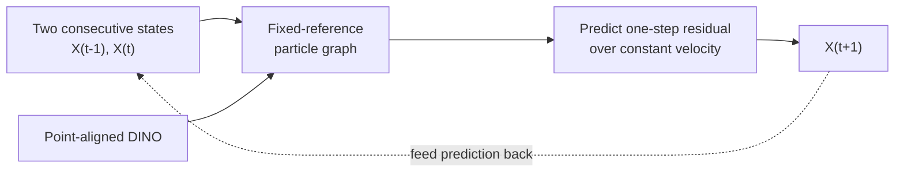
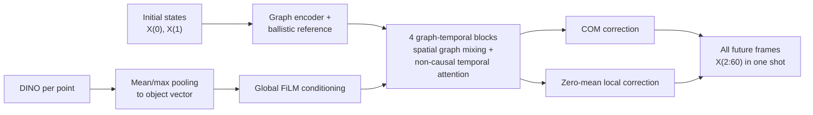
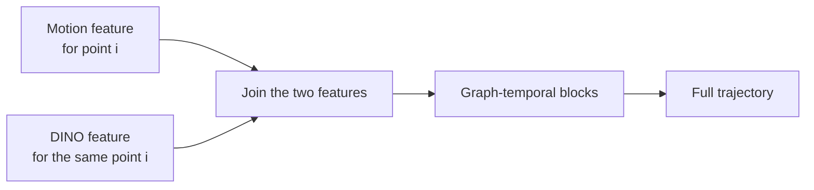
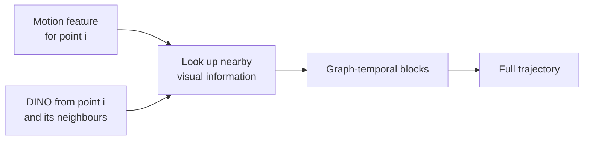
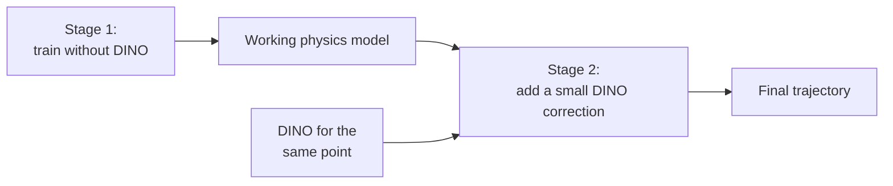
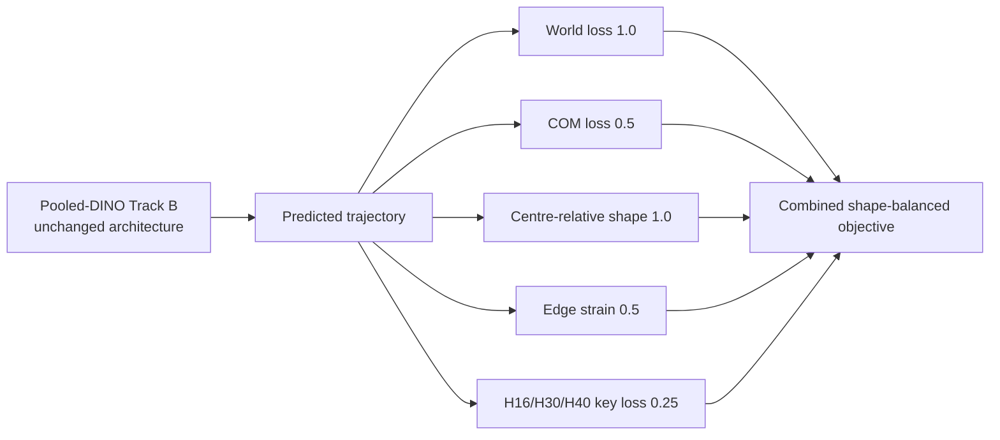
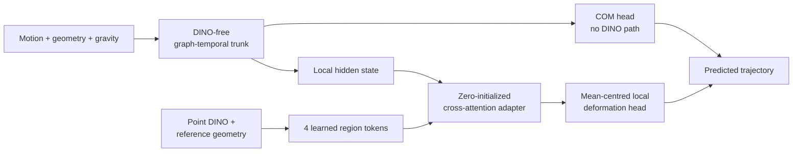

# DINO-POC V4/V4.1 Experiment Summary

Date: 2026-07-28

## 1. Goal

V4 asks whether the new force-free dataset can support an
architecture that:

1. uses DINO effectively as visual conditioning; and
2. remains accurate over long prediction horizons.

The experiments use persistent 3D surface points and DINOv2-small features.
The main evaluation is object-held-out and reports world-space RMSE by horizon.
For V4.1, the primary panel is the balanced rigid/soft, zero-velocity **Panel
Z**; the rigid variable-velocity **Panel V** is kept separate.

## 2. Autoregressive versus one-shot trajectory generation

### Track A1 — autoregressive graph dynamics

Track A1 learns a reusable one-step transition and has strong immediate
anchoring. Its weakness is recursive error accumulation: small motion/contact
errors become inputs to the next prediction.

### Track B — one-shot graph-temporal transformer

Track B predicts the entire future simultaneously, avoiding recursive rollout
drift. Its original DINO path compresses all point features into one global
vector, so it does not preserve point-to-feature correspondence.

### Key architecture comparison

Object-weighted test RMSE on the same ten held-out rigid/soft objects; Track
A1 and Track B values are three-seed means.

| Model | Generation | DINO interface | H1 | H8 | H16 | H59 | Main finding |
|---|---|---|---:|---:|---:|---:|---|
| Constant velocity | analytic rollout | none | **7.28** | 81.72 | 60.05 | 158.21 | Strong short baseline; weak endpoint |
| Track A1, zero | autoregressive | zero control | 7.30 | 82.44 | 65.07 | 249.74 | Good H1; severe long-rollout drift |
| Track A1, real | autoregressive | point-aligned graph input | 7.29 | 82.05 | 64.81 | 254.34 | No robust DINO gain |
| Track B, zero | one-shot transformer | zero control | 23.81 | **57.40** | **51.35** | 77.88 | Large long-horizon gain, but H1 degrades |
| Track B, real | one-shot transformer | pooled global FiLM | 29.76 | 62.90 | 57.79 | **64.76** | Worse than zero at H1/H8/H16; H59-only gain |

All errors are millimetres. The architectural conclusion is that simultaneous
graph-temporal prediction substantially reduces long-horizon drift, but the
current one-shot model sacrifices short-horizon accuracy. Pooled DINO does not
improve the co-primary H8/H16 result.

## 3. Different ways of adding DINO to Track B

The original Track B compressed all DINO features into one object-level vector.
This may have thrown away useful information about which DINO feature belongs
to which surface point. M1, M2 and M6 keep this point-level relationship, but
add DINO to the model in different ways.

### M1 — attach DINO directly to each point

M1 is the simplest approach. For every surface point, its DINO feature is
attached directly to its motion feature. The combined feature is then passed
through the transformer.

In short: **each point carries its own DINO feature throughout the prediction.**

### M2 — let each point look at nearby DINO features

M2 gives the model a little more flexibility. Instead of using only the DINO
feature at the exact same point, each point can look at the visual features of
itself and its nearby points.

This is useful when a point has no valid DINO observation: it can still use
visual information from the surrounding region.

In short: **each point uses DINO from its local neighbourhood.**

### M6 — train the physics model first, then add DINO

M6 avoids asking the model to learn physics and use DINO at the same time.
First, it trains the trajectory model without DINO. It then adds a small DINO
branch that is only allowed to adjust the existing prediction by a limited
amount.

In short: **learn the general motion first, then test whether DINO can make a
small improvement.**

### Key DINO-mechanism matrix

Panel Z three-seed object-weighted means; all errors are millimetres.

| Mechanism | How DINO is used | Real/zero H1 | Real/zero H30 | H30 wins | Real/zero H40 | H40 wins | Decision |
|---|---|---:|---:|---:|---:|---:|---|
| M1 | Attach DINO to the matching point | 8.92 / 7.57 | **39.58 / 41.50** | 2/3 | **31.13 / 33.08** | 3/3 | Better at H30/H40, but H1 became 17.8% worse |
| M2 | Let each point use nearby DINO | incomplete | incomplete | — | incomplete | — | No conclusion: two real-DINO runs failed the H1 checkpoint requirement |
| M6 | Add DINO after training the physics model | 8.93 / 4.52 | 43.94 / 42.64 | 2/3 | 35.30 / 34.01 | 2/3 | Worse on average, with H1 97.5% worse |

M1 was the only version showing some benefit at H30 and H40. However, it made
the first predicted frame worse, increased floor penetration, and mostly
improved the object's overall position rather than its shape. With only ten
test objects, the improvement was also too uncertain to treat as a reliable
DINO result.

M2 did not produce enough valid runs for a fair three-seed comparison. M6
completed the comparison but performed worse than the zero-DINO version.

The practical conclusion is therefore simple: **none of M1, M2 or M6 showed
clear, reliable evidence that DINO improves long-horizon prediction.**

## 4. Shape-balanced loss experiment

The architecture remained the pooled-DINO Track B model; only the objective was
changed to emphasize centre-relative shape and edge strain.

### Key matrix — seed-456 prototype

| Panel Z metric | Shape-loss real | Shape-loss zero | Interpretation |
|---|---:|---:|---|
| H1 world RMSE | 29.70 mm | 29.63 mm | No real-DINO benefit |
| H8 world RMSE | 135.76 mm | 67.56 mm | Real is 68.20 mm worse |
| H30 world RMSE | 88.36 mm | 47.78 mm | Real is 40.58 mm worse |
| H40 world RMSE | 84.08 mm | 38.87 mm | Real is 45.21 mm worse |
| H59 world RMSE | 5024.67 mm | 713.48 mm | Catastrophic endpoint instability |
| Soft H30 shape error, zero | — | 5.962 mm vs 6.004 mm legacy | Only 0.7% improvement |
| Soft H40 shape error, zero | — | 6.602 mm vs 6.508 mm legacy | 1.4% worse |

The revised loss did not materially improve soft deformation, damaged COM and
short-horizon accuracy, and became unstable at the endpoint after removing the
legacy H59 anchor. The loss was therefore rejected and the stable legacy loss
was restored.

## 5. Split-region architecture: isolate COM from DINO

The current direction separates global motion from local deformation. A
DINO-free physical trunk and COM head dominate the trajectory; DINO is allowed
to affect only the local, mean-zero shape branch through four learned
geometry-aware region tokens.

### Initial real-DINO versus zero-DINO result

Panel Z three-seed object-weighted means.

| Condition | H1 | H8 | H16 | H30 | H40 | H59 |
|---|---:|---:|---:|---:|---:|---:|
| Real DINO | **4.88** | **62.55** | 57.04 | **41.58** | **34.17** | 55.04 |
| Zero DINO | 7.15 | 63.32 | **56.11** | 44.46 | 35.02 | **50.22** |
| Real seed wins | 3/3 | 3/3 | 1/3 | 3/3 | 2/3 | 1/3 |

| Diagnostic | Result | Meaning |
|---|---|---|
| Numerical promotion | Passed at H30 and H40 | Triggered the shuffled controls reported below |
| H30 reduction | 6.49% | Positive medium-horizon result |
| H40 reduction | 2.42% | Positive but smaller |
| H59 change | 9.60% worse | Late-horizon stability trade-off |
| Shape/edge change | Effectively unchanged | Gain is almost entirely COM, not local deformation |
| Zero-DINO inference ablation on trained real model | Nanometre-scale change; COM output bit-identical | Visual path is practically inactive at inference |
| Bootstrap uncertainty | H30/H40 intervals include zero | Ten test UIDs are insufficient for a confident effect |

The split-region model is the first architecture to pass the frozen numerical
promotion rule, but it does **not yet demonstrate useful DINO conditioning**.
The real-versus-zero difference is more consistent with an optimization or
regularization-path effect because removing DINO from a trained real model
barely changes its output.

### Shuffled-control result

Two controls were then run:

- **Point-shuffled:** each object keeps its own DINO features, but the features
  are assigned to the wrong surface points. This tests whether point-to-DINO
  alignment matters.
- **Scene-shuffled:** each object receives DINO features from a different
  object. This tests whether object-matched visual content matters.

All six shuffled runs completed and passed the integrity and validation-H1
checks.

#### Panel Z comparison

Three-seed object-weighted world RMSE in millimetres:

| Condition | H1 | H8 | H16 | H30 | H40 | H59 |
|---|---:|---:|---:|---:|---:|---:|
| Real DINO | **4.88** | **62.55** | 57.04 | **41.58** | **34.17** | 55.04 |
| Zero DINO | 7.15 | 63.32 | **56.11** | 44.46 | 35.02 | **50.22** |
| Point-shuffled DINO | 7.49 | 64.48 | 58.11 | 45.10 | 35.91 | 86.27 |
| Scene-shuffled DINO | 5.94 | 64.77 | 60.16 | 49.52 | 40.27 | 479.51 |

The most useful comparison is real DINO against point-shuffled DINO:

| Horizon | Real | Point-shuffled | Real seed wins | Real minus shuffled, 95% interval |
|---:|---:|---:|---:|---:|
| H1 | 4.88 mm | 7.49 mm | 3/3 | [-3.79, -1.42] mm |
| H30 | 41.58 mm | 45.10 mm | 3/3 | [-6.43, -0.35] mm |
| H40 | 34.17 mm | 35.91 mm | 3/3 | [-6.89, +3.40] mm |

Real DINO beats point-shuffled DINO for all three seeds at H30 and H40. At
H30, the ten-object interval also excludes zero. This gives screening-level
evidence that keeping DINO aligned to the correct points led to a better
training outcome.

However, this is **not evidence that the final model learned better local shape
prediction**:

- centre-relative shape and edge errors are effectively identical across real,
  point-shuffled and scene-shuffled models;
- the difference is almost entirely in COM motion and floor penetration;
- zeroing DINO in an already-trained real model still changes its predictions
  only at nanometre scale;
- therefore, the trained visual branch is practically inactive at inference.

The most likely explanation is indirect training coupling. The DINO branch
cannot directly change the COM output, but its training gradients can still
change the shared physical trunk. Aligned and shuffled DINO can therefore lead
to different final COM models even if the DINO branch itself is later ignored.

#### Scene-shuffled result

The scene-shuffled mean is not reliable evidence for object-matched DINO. Seed
123 entered a much worse validation basin than the other controls and became
catastrophically unstable by H59. It dominates the three-seed average. At H40,
scene-shuffled seed 42 was actually better than real DINO, while seed 456 was
effectively tied.

The scene-shuffled experiment is therefore inconclusive rather than a clean
real-DINO win.

### Updated interpretation

The shuffled controls separate several different claims:

| Claim | Current conclusion |
|---|---|
| Does the split-region architecture pass the numerical promotion rule? | **Yes.** The original real-versus-zero promotion remains valid. |
| Did aligned DINO produce a better training outcome than point-shuffled DINO? | **Yes, at screening level.** Real wins 3/3 seeds at H30/H40, with the H30 interval excluding zero. |
| Does the trained model actively use DINO point correspondence at inference? | **No evidence.** Removing DINO barely changes the trained model's output. |
| Did DINO improve local deformation or shape prediction? | **No.** Shape and edge metrics are effectively unchanged. |
| Did real DINO robustly beat scene-shuffled DINO? | **Inconclusive.** The mean is dominated by one failed scene-shuffled seed. |

A stricter follow-up would stop gradients from the DINO-conditioned local
branch from modifying the shared COM trunk. That would test whether DINO can
improve local deformation directly, rather than changing global-motion
training indirectly.

## Overall conclusion

V4 established one-shot trajectory generation as the preferred direction. It
avoids the error accumulation seen in autoregressive rollout and gives a clear
advantage at longer horizons. The remaining weakness is short-horizon accuracy,
so the Track B backbone still needs better H1 anchoring and contact modelling.

The pooled-DINO, M1, M2, M6 and shape-loss experiments did not provide a clear
DINO improvement, but they helped narrow the problem: simply adding more DINO
conditioning or stronger shape supervision is not enough.

The split-region architecture is the most encouraging direction so far. It
separates global COM prediction from DINO-conditioned local shape prediction,
passes the numerical promotion rule, and real DINO performs better than the
point-shuffled control at H30 and H40. The exact source of this improvement is
not yet confirmed, but the result is positive enough to continue developing
the architecture. The next step is to isolate the local DINO branch more
strictly from the COM trunk and test whether DINO can produce a direct,
repeatable improvement in local deformation.
